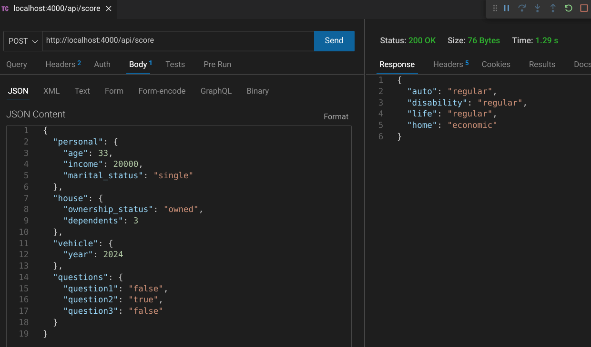

# Origin Financial Backend Assessment

This is a Spring Boot Conversion of [my past repo solution](https://github.com/jdegand/origin-backend-take-home-assignment) to [origin financial's backend take home assignment](https://github.com/OriginFinancial/origin-backend-take-home-assignment).  

The backend works with this [frontend](https://github.com/jdegand/origin-angular-frontend).

## Screenshots



## Built With

- Java 17
- Spring Boot 3.1
- VS Code

## How to Use

The Express application runs by default on `http://localhost:4000` and has the following endpoints:

 - `http://localhost:4000/api/score` - post endpoint that expects the form object below


### Expected Payload JSON

```json
{
  "personal": {
    "age": 35,
    "income": 0,
    "marital_status": "married"
  },
  "house": {
    "ownership_status": "owned",
    "dependents": 2
  },
  "vehicle": {
    "year": 2018
  },
  "questions": {
    "question1": "false",
    "question2": "true",
    "question3": "false"
  }
}
```

### Running the Spring Boot Application

```bash 

git clone https://github.com/jdegand/origin-spring-boot-backend.git

# need java jdk installed 

# cd into directory & run directly with maven or open in ide - click run button
```

### Running the Angular Application

Run the backend application first.

```bash

git clone https://github.com/jdegand/origin-angular-frontend.git

# cd into the directory
npm install 

npm start
```

## Thoughts

- Have to add @Valid in ApplicantData because properties are nested  
- The only standard annotations which can be applied to enum's are @NotNull and @Null.
- Adding custom validation for question to ensure question answers are only 'true' or 'false' requires an implementation similar to [this](https://stackoverflow.com/questions/74227120/how-can-i-create-custom-validator-on-java-list-type)
- Don't think using an entity makes sense since data is not saved to a database 
- Using DTO vs entity - not much practical difference - although I think it was a bigger issue in the past
- Didn't add setters to DTOs - necessary for more complicated testing logic ?

## Improvements

- Code Coverage plugin
- More tests
- Custom Validator for questions
- Error route 

## Useful Resources

- [Official Apache Maven documentation](https://maven.apache.org/guides/index.html)
- [Spring Boot Maven Plugin Reference Guide](https://docs.spring.io/spring-boot/docs/3.1.0/maven-plugin/reference/html/)
- [Create an OCI image](https://docs.spring.io/spring-boot/docs/3.1.0/maven-plugin/reference/html/#build-image)
- [Spring Web](https://docs.spring.io/spring-boot/docs/3.1.0/reference/htmlsingle/#web)
- [Building a RESTful Web Service](https://spring.io/guides/gs/rest-service/) - spring guide
- [Serving Web Content with Spring MVC](https://spring.io/guides/gs/serving-web-content/) - spring guide
- [Building REST services with Spring](https://spring.io/guides/tutorials/rest/) - spring guide
- [VS Code Docs](https://code.visualstudio.com/docs/java/java-project) - java vscode
- [JSON 2 CSHARP](https://json2csharp.com/code-converters/json-to-pojo) - json to pojo
- [YouTube](https://www.youtube.com/watch?v=zvR-Oif_nxg) - Spring Boot Complete Tutorial - Master Class
- [Github](https://github.com/shabbirdwd53/Springboot-Tutorial) - Springboot Tutorial Repo for Spring Boot Complete Tutorial - Master Class video
- [Stack Overflow](https://stackoverflow.com/questions/69639251/should-entity-class-be-used-as-request-body) - DTO or entity?
- [Spring Framework Guru](https://springframework.guru/requestbody-annotation/) - requestbody annotation
- [YouTube](https://www.youtube.com/watch?v=GYMz4sfHz-Y) - Coding Challenge #1 - RESTful Calculator with Java Spring Boot
- [Stack Overflow](https://stackoverflow.com/questions/70071007/how-can-i-return-an-object-from-a-post-method-with-spring-boot) - return an object from a post method with spring boot
- [Stack Overflow](https://stackoverflow.com/questions/71091905/spring-boot-mapping-between-entity-and-database-not-working-getting-in-res) - spring boot mapping between entity and database not working
- [Stack Overflow](https://stackoverflow.com/questions/64517537/springboot-validate-requestbody) - validate requestbody
- [YouTube](https://www.youtube.com/watch?v=93OBRePaoxY) - Spring boot Post Method Example with JSON and Postman
- [Stack Overflow](https://stackoverflow.com/questions/62588065/option-for-generating-getters-and-setters-not-showing-up-on-vs-code) - option for generating getters and setters on vscode
- [VS Code](https://code.visualstudio.com/docs/java/java-refactoring) - java refactoring
- [How to Do in Java](https://howtodoinjava.com/spring-mvc/controller-getmapping-postmapping/) - controller getMapping / postMapping
- [YouTube](https://www.youtube.com/watch?v=zMavMTK3qps&list=PLdW9lrB9HDw101ImXtR_xkvTe1HWx7Gc6&index=18) - RESTful Web Service with Spring Boot - Consume and Produce JSON or XML
- [Java Guides](https://www.javaguides.net/2021/04/spring-boot-dto-validation-example.html) - dto validation example
- [Stack Overflow](https://stackoverflow.com/questions/57704183/how-to-use-a-lambda-to-filter-a-boolean-array-in-java) - lambda to filter a boolean array
- [Stack Overflow](https://stackoverflow.com/questions/8260881/what-is-the-most-elegant-way-to-check-if-all-values-in-a-boolean-array-are-true) - most elegant way to check if all values in a boolean array are true
- [Spring Docs](https://docs.spring.io/spring-framework/docs/4.1.x/spring-framework-reference/html/validation.html) - validation
- [YouTube](https://www.youtube.com/watch?v=gPnd-hzM_6A) - Spring Boot | REST API Request Validation & Exception Handling Realtime Example | JavaTechie
- [Stack Overflow](https://stackoverflow.com/questions/59934783/how-do-you-change-the-spring-boot-dashboard-project-name-in-vs-code) - change spring boot dashboard project name in vscode
- [Stack Overflow](https://stackoverflow.com/questions/58336387/why-does-validation-not-work-on-objects-of-type-dto-but-only-on-entities) - validation not working with dto objects
- [Stack Overflow](https://stackoverflow.com/questions/57277850/spring-validator-class-does-not-validate-the-dto-data) - spring validator class does not validate the dto data
- [Stack Overflow](https://stackoverflow.com/questions/41005850/validation-nested-models-in-spring-boot) - validation nested models
- [Baeldung](https://www.baeldung.com/javax-validations-enums) - javax validations enums
- [Stack Overflow](https://stackoverflow.com/questions/6294587/java-string-validation-using-enum-values-and-annotation) - java string validation using enum values and annotation
- [Stack Overflow](https://stackoverflow.com/questions/62372281/how-to-validate-enum-in-dto) - how to validate enum in dto
- [YouTube](https://www.youtube.com/watch?v=P5sAaFY3O2w) - Spring Boot - Creating Custom Annotation For Validation | InterviewQA | JavaTechie
- [YouTube](https://www.youtube.com/watch?v=oKA2-aIEQaw) - 13. Spring Boot | Working with enum | @Enumerated
- [Stack Overflow](https://stackoverflow.com/questions/45968008/requestbody-valid-somedto-has-field-of-enum-type-custom-error-message) - requestbody valid custom error message
- [Fun of Programming Blog](https://funofprograming.wordpress.com/2016/09/29/java-enum-validator/) - java enum validator
- [Spring Docs](https://spring.io/guides/gs/rest-service-cors/) - rest service cors
- [Stack Overflow](https://stackoverflow.com/questions/74227120/how-can-i-create-custom-validator-on-java-list-type) - custom validator on java list type
- [Sololean](https://www.sololearn.com/compiler-playground/java) - compiler playground java
- [Free Formatter](https://www.freeformatter.com/json-escape.html#before-output) - escape json
- [Stack Overflow](https://stackoverflow.com/questions/72788387/mockmvc-contenttype-is-undefined-in-result-action) - mockMvc contentType is undefined in result action
- [Medium](https://medium.com/@karlrombauts/setting-up-unit-testing-for-java-in-vs-code-with-maven-3dc75579122f) - setting up unit testing for java in vs code with maven
